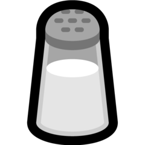

<p align="center">
    
</p>
<h1 align="center">❯ Salt</h1>
<h3 align="center">
Fast and simple task management from the CLI.
<h3>
<h1></h1>
<h3 align="center">
    <a href="https://github.com/Milo123459/salt/releases">
    
    </a>
    
    
</h3>
<h1></h1>
<h3 align="center">
<p>
    <a href="https://dev.to/milo123459/salt-task-managment-4m1m">DEV Post</a> | <a href="https://www.youtube.com/watch?v=GMMQiHexb3Y">YouTube Video</a>  | <a href="https://github.com/Milo123459/vscode-salt">VSCode Extension</a>
    </p>
</h3>
<h1></h1>

Read the **[dev post](https://dev.to/milo123459/salt-task-managment-4m1m)**

## Install

Windows: [Scoop](https://scoop.sh)

```
scoop bucket add sushi https://github.com/kidonng/sushi
scoop install sushi/salt
```

MacOS: [Brew](https://brew.sh)

```
brew tap eternalmoon1234/brew
brew install salt
```

Linux:

```
curl -fsSL https://raw.githubusercontent.com/Milo123459/salt/master/install.sh | bash
```

## Concepts

You have a node, and a task.

Think of it like a tree with apples. The tree is the node, the apples are the tasks. They just live under specific houses.

## Future ideas

- Stats (ie, which node you use the most)
- GitHub issue sync
- Sync across multiple devices

## How to use

Pretty simple:

Run `salt action` to see all commands.

Or, run `salt node action` to see all node sub-commands.